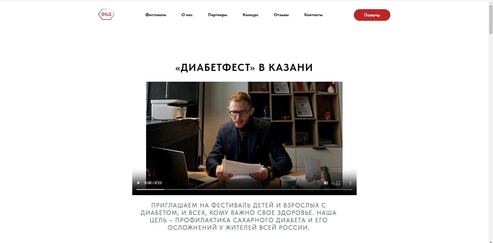
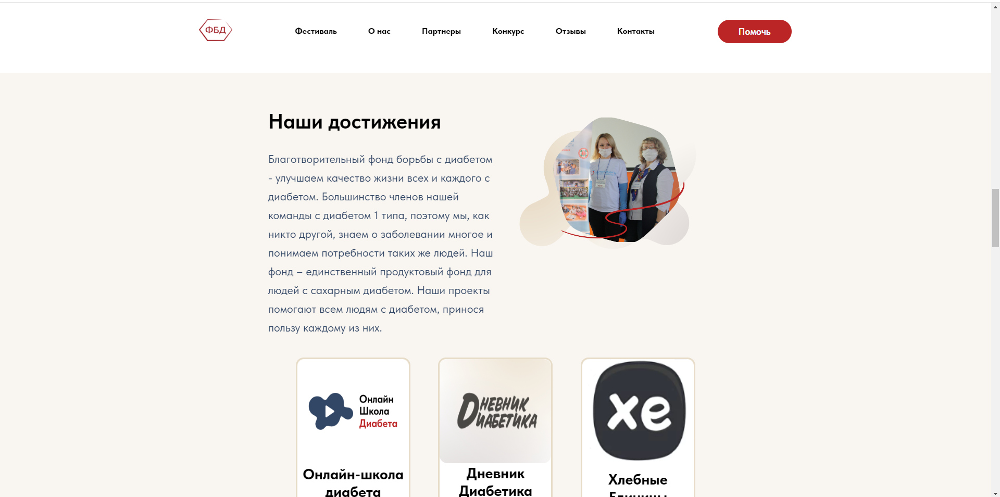
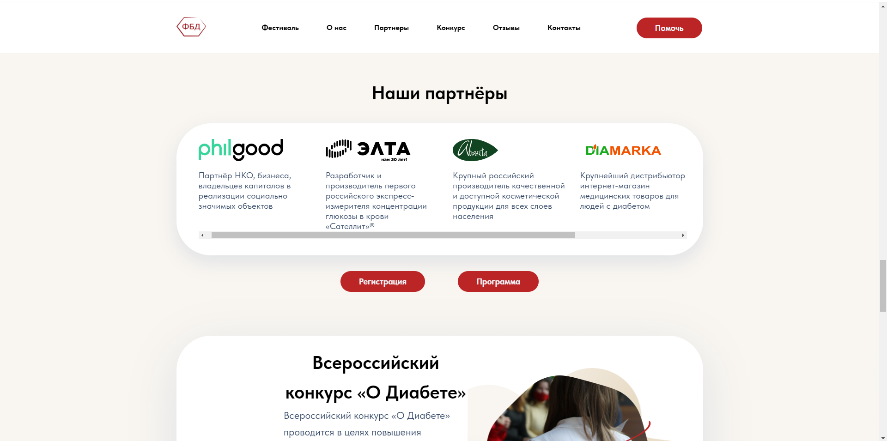
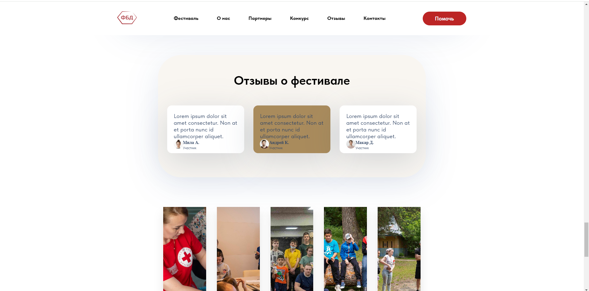
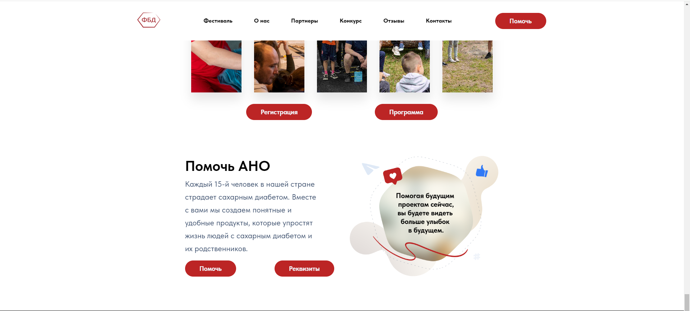

# ITgirls-PROJECT-2

<h1>Проект лендинга Vite, scss:</h1>  

https://nikaazizova.github.io/ITgirls-PROJECT-2.github.io/

 

 

1.Скопировать репозиторий локально

2.Запустить команду npm install

3.Запустить приложение npm run dev

 

Данный проект был разработан для заказчика который собирался организовать <strong>Фестиваль для Борьбы с Диабетом.</strong>

<strong>Цель данного фестиваля</strong> – профилактика сахарного диабета и его осложнений у всех жителей России. В данном проекте были использованы: препроцессор SASS, методология БЭМ, Flex, Grids, а также сайт адаптивен под разные размеры устройств.

<h2>Сторонние ресурсы организации:</h2>

Благотворительный фонд по борьбе с диабетом: https://vk.com/diabet.fond

Онлайн-школа Диабета: https://vk.com/shkola.diabeta

Дневник Диабетика: https://vk.com/dnevnik.diabetika

Хлебные Единицы: https://vk.com/calculatorxe

Проект диагностика Диабета: https://diabet.tatar/test/

О Диабете: https://vk.com/o_diabete

 

 

 

 

 

